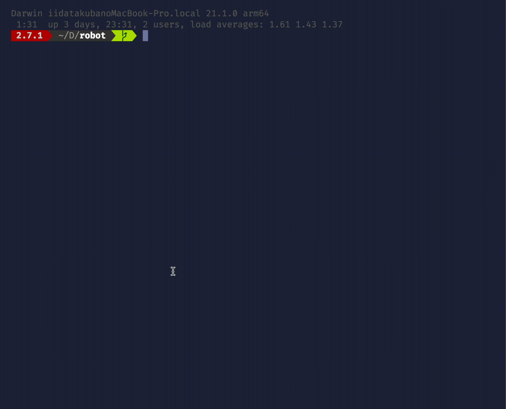

# Robot Console

## デモ

## できること

1. stage.yml にステージ情報を記載する
2. input.txt にロボットを動かす処理を記載する

## input.txt にて使用できる構文

- `go_front`
  - 前方に障害物/壁に接するまで進む
- `go_back`
  - 後方に障害物/壁に接するまで進む
- `turn_right`
  - 右回りに 90 度回転する
- `turn_left`
  - 左回りに 90 度回転する
- `loop(x)` - `end`
  - `loop` - `end` 内の処理を x 回繰り返す
  - 多重ループも使用可能
  - インデントは処理に影響しない
